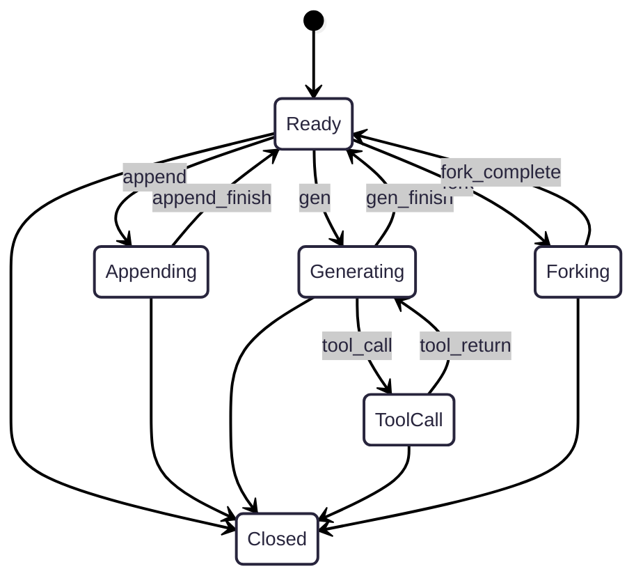
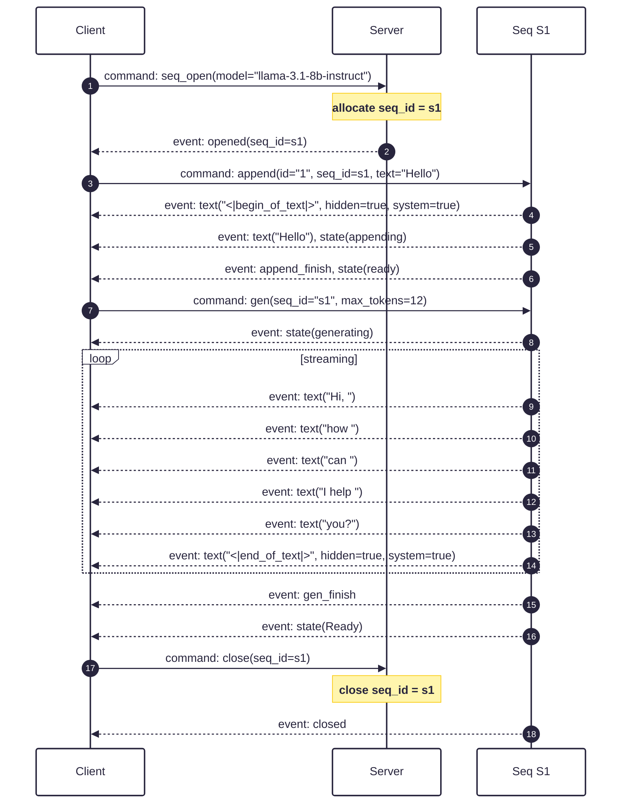

## Introduction

This document describes _**ModelSocket**_: an open, streaming and stateful protocol for integrating with large language models (LLMs). 

ModelSocket aims to be an alternative to REST APIs where low latency, stateful and bi-directional communication is a priority. 

## Why ModelSocket?

### Statefulness

If you've used an LLM REST API, perhaps you've wondered why you commonly have to remind the server of all of your previous requests every time you make a new one. 

For example, if you're implementing a chatbot, you have to create a new connection and retransmit the entire conversation history for each new message. Tool call? New connection and retransmit the entire history. This is because these APIs are totally _stateless_.

Barring some clever tricks like context window caching, the model has to reprocess everything it's seen before to give you a new answer. 

ModelSocket gives you a stateful interface into an LLM's context window so that you don't waste extra tokens and time repeatedly reprocessing the same information. 

### Low-level control

Inference engines are rich in functionality but exposing them via a REST API gives you a limited projection of their capabilities and inner workings (many of which might be useful to you as a developer!). 

For example, when you invoke a typical REST API, the model will typically combine the prefill (showing the model a prompt) and decode (generating tokens) phases into a single request. But consider if you wanted to be able prefill a sequence using a stream as a source without having the materialize it first. Or, if you wanted to orchestrate prefilling two models simultaneously (e.g., integrating a guard model with a chat bot). Neither of these are possible with a REST API.

ModelSocket exposes you to the primitives of the inference engine so you can invoke these operations directly. Prefilling and token generation are two discrete, disaggregated operations that can be orchestrated in novel ways.

### Forking

LLM context windows are resource intensive to generate. If you've spent the time and compute resources to show a model a long prompt, it's worth it to maximize the amount of information you can extract out of it. For these situations ModelSocket gives you the ability to _fork_ or create inexpensive copies of context windows. 

Many inference engines are based on blockwise attention mechanisms like [Paged Attention](https://arxiv.org/abs/2309.06180). These attention algorithms allow you to cheaply fork context windows in the same way the operating systems fork pages of virtual memory.   

For inference engines that support it, ModelSocket gives you direct access to this capability. 

For example, let's say you're analyzing a large document. You append 20,000 tokens to the model's context window. Now, instead of analyzing the document serially, you can create a fork for each analysis that you want to perform. Generating new tokens in this way takes advantage of the parallelism in the model's GPU (child sequences can be co-scheduled in the same batch and the KV cache is shared with the parent). 

The ability to fork sequences also allows you to implement powerful inference time compute algorithms like Best of N and beam search in situations where you want to trade more time and compute for higher quality results.

## Protocol

The ModelSocket protocol is based on a bi-directional stream of simple UTF-8 encoded JSON messages sent over a WebSocket connection.

When establishing a connection, the client must provide the `Sec-WebSocket-Protocol` header with the value `modelsocket.v0`. 

Clients issue requests to the server and recieve events in response. Most requests are one-to-many, that is, a single request can trigger zero or more events in response. For example, a sending a generate command request to a sequence will trigger a series of text events in response. 

When a request is sent, a correlation ID is specified so that the client can match server-generated events to the request. 

```js title="Example request message"
/* 
 * Example request message
 */
{
  // correlation ID (client-generated) [string; required] 
  // used to match requests to events sent by the server  
  "cid": "cmd_1234",         
  // request type [string; required]   
  "request": REQUEST_TYPE, 
  // request data [object; required]   
  "data": {  
    /// request type-specific payload
    ... REQUEST_PAYLOAD
  }
}
```

Requests will produce events, here's an example event: 

```js title="Example event message"
{
  // event type [string; required]
  "event": EVENT_TYPE,
  // correlation ID [string; optional]
  "cid": "cmd_1234",
  // event data [object; required]
  "data": {
    ... EVENT_PAYLOAD
  }
}
```

## Seqs

The primary building block of ModelSocket is a **Seq** (short for "sequence"). A Seq is a representation of tokens, text and KV cache on the inference server.

### States

The behavior of a Seq is governed by a simple Finite State Machine (FSM). There are two inputs that drive transitions between states: 

* Commands sent by the client
* Events generated by the model

The following diagram illustrates the states and transitions of a Seq: 



### Tokens 

Tokens must be expressed as fragments of utf-8 encoded text or as an array of integers. 

Tokens may also be marked as hidden or system tokens. This allows clients to easily filter out tokens that aren't relevant to the application. 

For example, a model will typically emit certain system tokens that are necessary to function correctly: 

  * a BOS or "begin of stream" token when the Seq is opened 
  * an EOS or "end of stream" token when the model is finished generating tokens
  * a token to indicate the "role" of a fragment of text 
  * a special token to indicate the beginning of a new turn in a multi-turn conversation, etc.

These tokens are typically not surfaced in applications, but they can be important when troubleshooting or debugging model behavior. 

You may also request that your generated tokens be marked as hidden. This is useful when you want to generate some tokens that affect the state of the model but easily filter out this state from your users. 

### Opening

`seq_open` is used to open a new sequence on a socket for a given model. It's typically called immediately after a connection is established with the server. The `model` field is used to specify which model to use for the sequence and is specific to the server you're connected to.

```js title="Example open message"
{
  // correlation ID (client-generated) [string; required]   
  "cid": "cmd_1234",         
  // request type [string; required]   
  "request": "seq_open", 
  // request data [object; required]   
  "data": {  
    // model to allocate a new seq for [string; required]
    "model": "llama-3.1-8b-instruct" 
  }
}
```

### Prompting & Appending

The `seq_append` command request is used to append new tokens to a sequence. Either `text` or `tokens` must be provided, but not both.

```js title="Example append message"
{
  // request type [string; required]
  "request": "seq_command",
  // correlation ID [string; required]
  "cid": "cmd_123",
  // request data [object; required]
  "data": {
    // sequence ID [string; required]
    "seq_id": "s1",
    // command type [string; required]
    "command": "append",
    // text to append [string; optional]
    "text": "What is the meaning of life?\n",
    // specify raw tokens to append [array<u32>; optional]
    "tokens": null,
    // mark returned tokens as hidden? [boolean; optional; default=false]
    "hidden": false,
    // repeat tokens back to client? [boolean; optional; default=true]
    "echo": true,
    // role (e.g. "user", "assistant", "system") [string; optional]
    "role": "user"
  }
}
```

If `echo` is true, the server will send a series of `seq_text` events to the client as tokens are appended. 

```js title="Example append text event"
{
  // event type [string; required]
  "event": "seq_text",
  // correlation ID [string; optional]
  "cid": "cmd_789",
  // event data [object; required]
  "data": {
    // sequence ID [string; required]
    "seq_id": "s1",
    // text fragment [string; required]
    "text": "What is the meaning of life?\n"
  }
}
```

When the model is finished prefilling the tokens from your append command, the server will send an `append_finish` event to the client: 

```js title="Example append finish event"
{
  // event type [string; required]
  "event": "seq_append_finish",
  // correlation ID [string; optional]
  "cid": "cmd_123",
  // event data [object; required]
  "data": {
    // sequence ID [string; required]
    "seq_id": "s1"
  }
}
```

### Generating

The `seq_gen` command request is used to generate new tokens from a sequence. 

```js title="Example generate message"
{
  // request type [string; required]
  "request": "seq_command",
  // correlation ID [string; required]
  "cid": "cmd_101",
  // request data [object; required]
  "data": {
    // command type [string; required]
    "command": "gen",
    // sequence ID [string; required]
    "seq_id": "s1",
    // stop generating when any of these strings are encountered [array<string>; optional]
    "stop_strings": [ "\n" ],
    // maximum amount of text generate [u32; optional]
    "max_length": null,
    // maximum amount of tokens to generate [u32; optional]
    "max_tokens": null,
    // mark returned tokens as hidden? [boolean; optional; default=false]
    "hidden": false,
    // role (e.g. "user", "assistant", "system") [string; optional]
    "role": null,
    // sampling temperature [f32; optional]
    "temperature": null,
    // repeat penalty [f32; optional]
    "repeat_penalty": null,
    // random seed [u32; optional]
    "seed": null,
    // top-p sampling [f32; optional]
    "top_p": null,
    // return raw tokens? [boolean; optional; default=false]
    "return_tokens": null
  }
}
```

As the model generates tokens, the server will stream a series of `seq_text` events to the client. 

```js title="Example generate text event"
{
  // event type [string; required]
  "event": "seq_text",
  // correlation ID [string; optional]
  "cid": "cmd_789",
  // event data [object; required]
  "data": {
    // sequence ID [string; required]
    "seq_id": "s1",
    // text fragment [string; required]
    "text": SEQ_TEXT_FRAGMENT
  }
}
```

When the model is finished generating tokens, the server will send a `gen_finish` event to the client: 

```js title="Example generate finish event"
{ 
  // event type [string; required]
  "event": "seq_gen_finish",
  // correlation ID [string; optional]
  "cid": "cmd_101",
  // event data [object; required]
  "data": {
    // sequence ID [string; required]
    "seq_id": "s1" 
  }
}
```

### Tool calling

Tool calling is a special case of generating tokens. When the model is generating tokens, it may choose invoke a tool by emitting a `seq_tool_call` event. The model may emit multiple tool calls in a single event. 

```js title="Example tool call event"
{ 
  // event type [string; required]
  "event": "seq_tool_call",
  // correlation ID [string; optional]
  "cid": "cmd_101",
  // event data [object; required]
  "data": {
    // sequence ID [string; required]
    "seq_id": "s1"

    // tool calls [array<ToolCall>; required]
    "tool_calls": [ 
      {
        // tool name [string; required]
        "name": "get_weather",
        // tool call parameters [object | string; required]
        "params": {
          "city": "San Francisco"
        }
      }
    ]
  }
}
```

When the client is finished tool calling, it must send a `seq_tool_return` command request to the server. 

```js title="Example tool return message"
{ 
  // request type [string; required]
  "request": "seq_command",
  // correlation ID [string; required]
  "cid": "cmd_123",
  // request data [object; required]
  "data": {
    // sequence ID [string; required]
    "seq_id": "s1",
    // command type [string; required]
    "command": "tool_return",
    // tool results [object | string; required]
    "tool_results": [ 
      {
        // tool name [string; required]
        "tool_name": "get_weather",
        // tool result [object | string; required]
        "result": {
          "temperature": 68.9,
        }
      }
    ]
  }
}
```

### Fork

```js title="Example append message"
{
  // request type [string; required]
  "request": "seq_command",
  // correlation ID [string; required]
  "cid": "cmd_123",
  // request data [object; required]
  "data": {
    // sequence ID [string; required]
    "seq_id": "s1",
    // command type [string; required]
    "command": "fork",
  }
}
```

### Close

The `seq_close` command request will close a sequence. Closing a sequence will cause the server to release the resources associated with the sequence. 

```js title="Example close message"
{
  // request type [string; required]
  "request": "seq_command",
  // correlation ID [string; required]
  "cid": "cmd_123",
  // request data [object; required]
  "data": {
    // sequence ID [string; required]
    "seq_id": "s1",
    // command type [string; required]
    "command": "close"
  }
}
```

When the server has closed the sequence, it will send a `seq_closed` event to the client: 

```js title="Example close event"
{
  // event type [string; required]
  "event": "seq_closed",
  // correlation ID [string; optional]
  "cid": "cmd_123",
  // event data [object; required]
  "data": {
    // sequence ID [string; required]
    "seq_id": "s1"
  }
}
```

### Errors 

Errors are sent as `error` events. When possible, errors contain a correlation ID and/or a seq ID so the client can match the error to the request that caused it. 

```js title="Example error message"
{
  "event": "error",
  "data": {
    "message": "error message"
  }
}
```

Errors may cause the server to close the connection. 

### Example flow

The following diagram illustrates a simple example of a Seq being used to produce a single chat turn.



## Support and Feedback

Join us on [Discord](https://discord.gg/3UEk9rmBJX) to discuss ModelSocket and get support. 


## TODO 

- Add a link to the reference implementation. 
- Section on useful tools
- Separate out the protocol with more normative language from tutorial-style text
- Refine envelope descriminators, make parsing easier (e.g., make seq_id top-level and required on seq_* events)
- Fix underspecified error payloads, specify error codes, connection vs seq-level errors
- Specify errors for invalid commands during each state 
- Specify timeouts/heartbeats/keepalives/pings/etc
- Specify exactly what is copied when a seq is forked
- Discuss backpressure 
- Discuss quota errors 
- Discuss compression
- Discuss message size limits 
- Discuss transport requirements (TLS, ordered delivery, persistent connection, full duplex streaming)
- Make some capabilities optional (e.g., fork)


## Changelog

### v0.0.1 (2025-05-21)

* Initial draft. WIP.